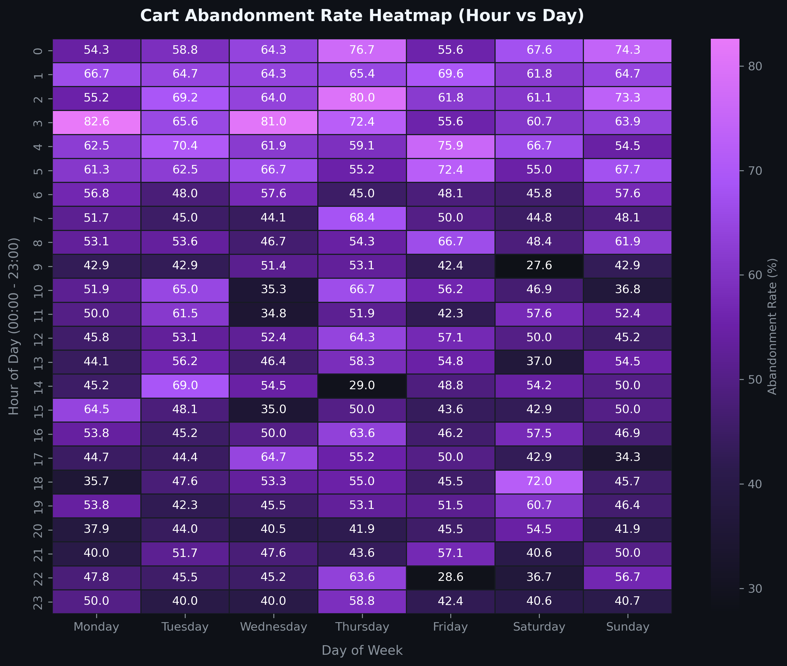
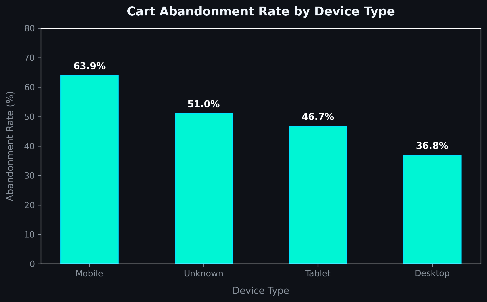

# 🛒 E-Commerce Cart Abandonment & Customer Cohort Analysis


An end-to-end data analytics project focused on analyzing **E-Commerce Cart Abandonment Patterns** and **Customer Cohort Behaviors**. This project generates a realistic synthetic dataset, cleans missing values, performs feature engineering, conducts Exploratory Data Analysis (EDA), and generates dark-themed visualization dashboards.

---

## 📌 Executive Summary & Key Findings

* **Overall Cart Abandonment Rate**: `53.08%` across 5,000 recorded sessions.
* **Device Disparity**: Mobile devices experience the highest abandonment rate (**63.90%**), compared to Desktop (**36.84%**) and Tablet (**46.70%**).
* **Time-Based Peak**: Late-night sessions (**00:00 - 05:00**) show a massive surge in cart abandonment, peaking at **68.45%** around 03:00 AM.
* **Cart Value Influence**: Carts over `$200` demonstrate elevated hesitation rates due to price friction.

---

## 📊 Visual Dashboards

### 1. Hourly & Daily Cart Abandonment Heatmap
Visualizes abandonment probability hotspots across hours of the day (00:00 - 23:00) and days of the week (Monday - Sunday).



### 2. Abandonment Rate by Device Type
Compares checkout failure rates between Mobile, Desktop, Tablet, and Unknown devices.



---

## 📁 Project Structure

```text
ecommerce_cart_abandonment/
│
├── generate_data.py               # Phase 1: Synthetic data generator script (5,000 records)
├── clean_and_engineer.py          # Phase 2: Missing value imputation & feature extraction
├── eda_abandonment.py             # Phase 3: Exploratory Data Analysis & Groupby metrics
├── create_visualizations.py       # Phase 4: Dark-themed Matplotlib & Seaborn chart generator
│
├── ecommerce_cart_data_raw.csv    # Raw generated dataset with deliberate missing values
├── ecommerce_cart_data_cleaned.csv# Processed, cleaned, and feature-enriched dataset
│
├── cart_abandonment_heatmap.png   # High-resolution PNG heatmap output
├── cart_abandonment_device_barchart.png # High-resolution PNG bar chart output
└── README.md                      # Project documentation
```

---

## 🛠️ Pipeline & Execution Guide

### 1. Data Generation (Phase 1)
Generates 5,000 synthetic transaction records with realistic behavioral patterns and deliberate missing values in `cart_value` and `device_type`.
```bash
python generate_data.py
```

### 2. Data Cleaning & Feature Engineering (Phase 2)
Imputes missing values (median imputation for `cart_value`, `'Unknown'` for `device_type`), converts timestamps, and extracts `hour_of_day` and `day_of_week`.
```bash
python clean_and_engineer.py
```

### 3. Exploratory Data Analysis (Phase 3)
Calculates overall and grouped abandonment metrics using Pandas `.groupby()`.
```bash
python eda_abandonment.py
```

### 4. Advanced Data Visualization (Phase 4)
Generates high-resolution, dark-mode dashboard visualizations.
```bash
python create_visualizations.py
```

---

## 🗃️ Dataset Schema

| Column Name | Data Type | Description |
| :--- | :--- | :--- |
| `user_id` | `String` | Unique customer identifier (`USER_0001` - `USER_1500`) |
| `session_start_time` | `Datetime` | Timestamp of checkout session initiation |
| `device_type` | `String` | Device used (`Mobile`, `Desktop`, `Tablet`, `Unknown`) |
| `cart_value` | `Float` | Total monetary value of items in cart ($) |
| `checkout_status` | `String` | Target variable (`Completed` or `Abandoned`) |
| `hour_of_day` | `Integer` | Extracted hour of session start (`0` to `23`) |
| `day_of_week` | `String` | Extracted day name (`Monday` to `Sunday`) |

---

## 💡 Strategic Business Recommendations

1. **Mobile UX Optimization**: Streamline the mobile checkout funnel with one-click payment solutions (e.g., Apple Pay, Google Pay) to reduce the 63.9% mobile abandonment rate.
2. **Automated Late-Night Abandoned Cart Emails**: Trigger automated cart recovery notifications 30–60 minutes after late-night sessions (00:00 - 05:00).
3. **High-Value Cart Incentives**: Offer free shipping or dynamic discounts for carts exceeding $200 to address price hesitation.

---

## 🚀 Technologies Used

- **Language**: Python 3.13
- **Data Manipulation**: `pandas`, `numpy`
- **Data Visualization**: `matplotlib`, `seaborn`
